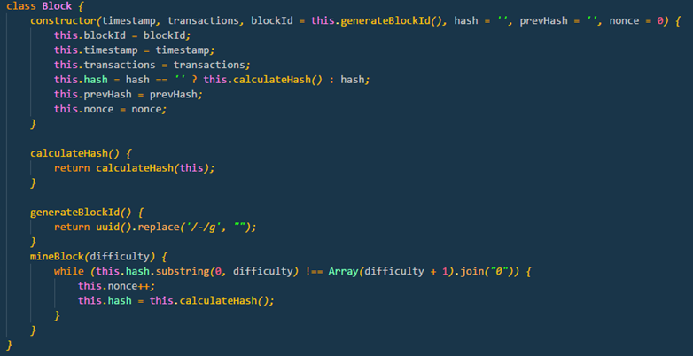

# Blector 
## Electronic Voting using block chain (reference Implementation)
	
# Blector Introduction
* Blector is an electronic voting system , Developed using block chain technology as a reference implementation.
* Block chain is a platform where we can implement usecase.
* Data once created cannot be tampered.
* Electronic voting is one of the use case of block chain platform.
* Blector is developed using Node , express and react js.

# Block chain Overview
* The blockchain is a decentralized database that records the data , it could be money transaction , Supply chain, Votes, assests etc.,
* It consist of Block and chain , and entire data is synchronized accrossed the network
* It could be public(bitcoin) and private (hosted in an organization)

# Block Chain Key terms
* __ADDRESS__ Used to receive and send transactions 
* __BLOCKCHAIN__ Blockchains are distributed ledgers, secured by cryptography.
* __BLOCKS__ Transactions from the network fill blocks.
* __MINING & HASHING__ The process of trying to ‘solve’ the next block. 
* __NODES__ A computer that possesses a copy of the blockchain and is working to maintain it. 
* __SMART CONTRACTS__ Also known as a smart property, they are computer protocols that facilitate, verify, or enforce the negotiation
* __Public and Private Keys__ User Id and Password

# Blector Architecture

# Transaction and Smart contract
## Transaction
* Transaction data is important param in the block chain
* In Blector the transaction is just the voter , candidate ,vote count, ID ( to track the Txn )

## Smart Contract
* Smart contract is kind of protocol to accepts  the transaction 
* In Blector , contract is to make sure the voter can cast his/her vote only once
* For duplicate voting , send the transactions to rejected queue

# Block

* A __block__ is record of some or all of the most recent transactions that have not yet entered any prior blocks. 
* Block is like a page of a ledger or record book. Each time a block is 'completed', it gives way to the next block in the blockchain.
* Block consist of important parameters like Timestamp, Transaction , Hash value , previous Hash value
* It can also include other parameters based on the requirement 

## Block in Blector
* In Blector, Block has 
	* Time stamp
	* Transactions
	* Hash
	* Previous hash
	* Nonce
	* Block id 
	* Method to mine the block & calculate hash 

# Chain

* Chain in continuous growing block of records , where the data is tamper free 
* Chain include validation & update of local chain
* Many other operation on transactions ( based on requirement )

## Chain in Blector
* In Blector , chain consist of array of block , difficulty level, array of pending transaction , array of rejected transactions, nodes it connected, mine reward ( can be used if required) , my current transactions
* Operations include
	* Creating transaction – validate the smart contract and create the txn
	* Validate and update the local chain 
	* Check how many votes cast for the candidate
	* Check whether the voter already cast vote

# Mining & proof of work
* Mining is a process of creating a block from the pending transaction and add to the chain.
* Proof of work is to validate the chain and broadcast to the other nodes in the network.
* Mining uses a custom or existing algorithm to create the block.
	* Creating a block means generating hash of the block , 
	* Generating the hash using the algorithm 
	* Algorithm is simple to complex , usually SHA256
  

## Mining & proof of work in Blector

* In Blector , Mining algorithm is simple . 
* Ie., you need to generate the hash until you get hash starts with 5 zero’s.  ( 5 is defined in difficulty level)
* Change the nonce to achieve the above hash value.

# Distribution
* Each important action in the blockchain will be notified to all the nodes in the netowork
* The actions like 
	* Creating transaction 
	* Mining the block 
	* Adding or removing the node etc.
	
## Distribution in Blector
* In Blector , When voter cast the vote , it will be sent to all the nodes in NW. 
* Once the mining is done the chain is broadcasted .
* Each node will validate the chain update or reject the chain.

# Casting Vote
* Once the  voter cast the vote the vote is broadcasted to all the poll booths connected to the poll manager
* The same voter cannot cast the vote again , it will go into rejected txn , in UI voter simply cannot cast the vote again
* Blector will mine the block on user request.
